# RoboRoute 用户手册

## 一、简介

### 1.1 RoboRoute 简介

RoboRoute 是上海仙知机器人科技有限公司（Seer Robotics，以下简称 仙知）开发的多机器人调度系统。  仙知整合 RoboRoute 系统、Roboshop Pro 软件，以及 SRC2000 系列控制器，可针对多种类、多数量移动机器人进行复杂操作与协同配合的场景，提供快速、专业的整厂解决方案，以此提升工厂的整体作业效率。

 

### 1.2 RoboRoute 主要功能

RoboRoute 系统的核心功能如下：

- **机器人调度**

  - 任务分配

      将业务订单分配给最合适的机器人执行。

  - 路线规划

      为执行业务的机器人规划合理的移动路线。

  - 交通管制

      预防机器人之间发生碰撞。

      解决机器人在运行中的路线冲突。

- **场景编辑**

  配合 Roboshop Pro 软件，编辑机器人的移动路线及节点。

  配置工作站、充电桩信息。

  配置机器人可操作的业务类型、动作类型等。

- **状态监控**

  在系统运行期间，实时监控整场机器人的在线状态、所处位置、行进路线、业务进度等。

  也可聚焦具体的机器人，对其进行持续跟踪。

- **机器人管理**

  管理机器人列表，控制机器人在 RoboRoute 系统中上下线。

  指定机器人前往节点或工作站。

  撤销机器人正在执行的业务。

  在不影响生产运输前提下，自动引导低电量机器人回坞充电。

- **业务管理**

  支持可视化地创建业务订单。

  通过执行状态，筛选业务订单列表，并获取订单的详细信息。

  批量撤销业务订单。

- **业务统计**

  统计机器人的累计运行时间、停靠和充电时间，以及整体利用率。

  统计工作站的累计访问时间。

  统计业务订单的分配和执行时间，以及完成情况。

- **交互协议**

  提供简洁的 HTTP 访问协议。通过协议可以：

  创建、查询及撤销业务订单。

  查询机器人的状态，或指定机器人在 RoboRoute 系统中上下线。

## 二、部署环境

### 2.1 RoboRoute 服务器

RoboRoute 的硬件载体选用 联想 ThinkStation P318 工作站，其主要优点有：

- 工作站级主机，满足工厂 7 × 24 小时的不间断生产需求。

- 品牌型号入选节能环保清单，即《[环境标志产品政府采购清单](http://www.ccgp.gov.cn/search/hbqdchaxun.htm)》和《[节能产品政府采购清单](http://www.ccgp.gov.cn/search/jnqdchaxun.htm)》。

RoboRoute 服务器的主要配置：

- CPU：英特尔酷睿Core i7-7700

- RAM：16G DDR4 2133 NECC

- 硬盘：1TB

- 操作系统：Ubuntu 16.04

**请注意：**

**为保证用户权益及系统稳定性，RoboRoute 软件仅在仙知指定的 RoboRoute 服务器上运行。**
 **请勿拆下 RoboRoute 服务器上的授权锁。**

### 2.2 机器人及 RoboShop Pro 软件

加入 RoboRoute 调度序列的机器人，必须满足以下条件：

- 使用仙知 SRC1100 或者 SRC2000 系列机器人主控器。

- 使用含通信功能的电池，能够向 RoboRoute 反馈电量信息。

- 机器人具备自主充电能力。

### 2.3 WIFI 环境

现场无线推荐使用MOXA AWK-3131A无线AP，网络延迟控制在200ms之内，网络环境测试请参考：

<https://www.seer-robotics.com/index.do?detail&id=2c93b6e764c9d7430164cf4c3f6d006e> 

## 三、系统安装

### 3.1 硬件安装

RoboRoute 服务器的主机和显示器均为标准市电电源（AC 220V-50Hz），总峰值用电功率 ≤ 1KW，请合理安排电源，保证可靠接地。

RoboRoute 服务器的主要配件包括：

| 配件清单                               |
| -------------------------------------- |
| Thinkstation P318 主机（含授权锁） × 1 |
| 液晶显示器 × 1                         |
| 键鼠套装 × 1                           |

RoboRoute 服务器应部署在室温环境，10°C~30°C 之间。

RoboRoute 服务器应部署至可以目视、或者视频监控到机器人运行现场的地点。并且在该地点，要求能够使用双绞线，将 RoboRoute 服务器连接到机器人所在的局域网络设备中。

### 3.2 密码和账户

RoboRoute 服务器的初始账户为：RoboRoute，初始密码为：roboroute，请注意密码的大小写。

### 3.3 网络配置

请使用超五类双绞线，将 RoboRoute 服务器主机连接至现场局域网络。

请为 RoboRoute 服务器配置静态 IP，并且注意，该局域网络内，不能有其他设备和服务器存在 IP 冲突。

请注意现场网络的覆盖范围，必须涵盖机器人会抵达的所有角落。

### 3.4 更新

软件更新以官网发布版，或者仙知的通知为准。

## 四、场景元素介绍

### 4.1 节点

节点（Point）是用于逻辑映射场景路线中关键位置的元素。在 RoboRoute 操作模式下，机器人总是从场景中的一个节点到另一节点运行。节点分为：地标点和停靠点，其属性如下所述：

其属性描述如下：

| 属性          | 描述                       | 属性          | 描述                   |
| ------------- | -------------------------- | ------------- | ---------------------- |
| 名称          | 节点的全局唯一 ID          | 类型          | 地标点，或者停靠点     |
| X-轴坐标      | 场景坐标系中 X 轴坐标      | 元属性        | 用户自定义的键值型属性 |
| Y-轴坐标      | 场景坐标系中 Y 轴坐标      | 节点 X 轴坐标 | 视图坐标系中 X 轴坐标  |
| 角度          | 机器人到点角度（暂未启用） | 节点 Y 轴坐标 | 视图坐标系中 Y 轴坐标  |
| 标签 X 轴坐标 | 节点ID X 轴坐标            | 标签 Y 轴坐标 | 节点ID Y 轴坐标        |
| 节点标签角度  | 节点ID 角度                |               |                        |

#### 4.1.1 地标点

在 RoboRoute 中，地标点（Land Mark）是机器人处理业务订单时可能短暂停留的节点，机器人在到达该节点时，执行工作站的操作；或者机器人在行进路线中经过的一系列节点。地标点标识为灰色圆点。

 

#### 4.1.2 停靠点

停靠点（Park Point）是供业务空闲的机器人停靠和待机的节点。机器人执行完毕当前的业务后，若没有新的业务被分配，会前往附近没有被占用的停靠点，等待新的业务订单。如果机器人的电量低于报警阈值，且此时不存在空闲的充电站，机器人也会前往停靠点，但不再接受新的业务订单。停靠点标识为蓝色圆点。

 

### 4.2 工作站

工作站（Location）是机器人需要进行业务操作的站点，不可以单独存在，必须使用工作站连接将其和节点关联起来。工作站限定了机器人在该处的工作内容。其属性包含：

 

其属性描述如下：

| 属性     | 描述                     | 属性            | 描述                          |
| -------- | ------------------------ | --------------- | ----------------------------- |
| 名称     | 工作站的全局唯一ID       | 标志            | 选择工作站图片区分工作站样式  |
| X-轴坐标 | 场景坐标系中的 X 轴坐标  | 工作站 X 轴坐标 | 视图坐标系中 X 轴坐标         |
| Y-轴坐标 | 场景坐标系中的 Y 轴坐标  | 工作站 Y 轴坐标 | 视图坐标系中 Y 轴坐标         |
| 类型     | 该工作站属于的工作站类型 | 标签 X 轴偏移量 | 视图窗口中工作站ID X 轴偏移量 |
| 方向角   | 暂不使用                 | 标签 Y 轴偏移量 | 视图窗口中工作站ID Y 轴偏移量 |
| 元属性   | 用户自定义的键值型属性   |                 |                               |

#### 4.2.1 工作站的元属性

元属性是一种描述参数的键值对，“键” 和 “值” 都是字符串类型。在 RoboRoute 系统中，大多数场景元素、业务订单都可以包含一个或者多个用户自定义的元属性，用于标识或者向机器人传递参数。

如果工作站的元属性非空，则这些参数将被传递给在此执行操作的机器人。例如，

“TL1” 是属于 “Transfer Location” 类型的工作站，该类型工作站可以进行辊筒运载车和产线的对接，而目前仙知的标准辊筒车可以在左侧或者右侧对接产线传送带。此处允许机器人执行的操作包含 “RollerLoad” 和 “RollerUnload”，这两个操作都需要一个 “direction” 参数。如果工作站 “TL1” 包含 ”键：direction，值：left“ 的元属性，那么此处的对接将全部默认在机器人的左侧进行；而在业务订单中，也不再需要提及在此处进行上料/下料操作时的方向。

### 4.3 工作站连接

工作站连接（Link）是用于将工作站和节点进行关联的工具，其属性包含：

 

其属性描述如下：

| 属性 | 描述                       | 属性     | 描述                 |
| ---- | -------------------------- | -------- | -------------------- |
| 名称 | 根据起始和终点元素自动生成 | 起始元素 | 地标点或工作站的名称 |
| 动作 | 工作站的操作类型限定       | 终点     | 地标点或工作站的名称 |

如果此处的“动作”内容为空，则在该处工作站，机器人可以执行工作站类型中定义的所有操作。

如果此处的“动作”内容非空，则在该处工作站，机器人只能执行工作站连接的“动作”栏所限定的操作。

 

### 4.4 工作站类型

工作站类型（Location Type）是一个工作站唯一且必需包含的元素，其主要定义了一组机器人允许执行的操作。其属性包含：

 

其属性描述如下：

| 属性 | 描述                     | 属性   | 描述                     |
| ---- | ------------------------ | ------ | ------------------------ |
| 名称 | 该工作站类型的全局唯一ID | 动作   | 一组允许机器人执行的操作 |
| 标志 | 用于区分不同工作站样式   | 元属性 | 用户自定义的键值型属性   |

 

### 4.5 路径

路径（Path）是两个节点之间的有向连接线。其主要属性包含: 

 

其属性描述如下：

| 属性         | 描述                         | 属性         | 描述                     |
| ------------ | ---------------------------- | ------------ | ------------------------ |
| 名称         | 路径的全局唯一ID             | 路径曲线类型 | 直线，或者贝塞尔曲线     |
| 长度         | 路径在场景中的长度           | 曲线控制点   | 只有贝塞尔曲线存在控制点 |
| 路径成本     | 路径在路线规划中的成本系数   | 起始元素     | 路径起点                 |
| 最大正向速度 | 路径上允许的最大正向行走速度 | 终点元素     | 路径终点                 |
| 最大反向速度 | 路径上允许的最大反向行走速度 | 锁定路径     | 锁定路径                 |
| 元属性       | 用户自定义的键值型属性       |              |                          |

 若一条路径因故无法通行，可以在系统运行时勾选“锁定路径”，令机器人规划路线时避开此路径。

#### 4.5.1 直线

由于 RoboRoute Viewer 中的场景视图只表示节点间的有向拓扑关系，并非实际的机器人行进路线，因此大多数情况下，使用直线连接节点即可。

#### 4.5.2 2-Bezier & 3-Bezier

贝塞尔曲线，又称贝兹曲线或贝济埃曲线，是应用于二维图形应用程序的数学曲线。一般的矢量图形软件通过它来精确画出曲线，贝塞尔曲线由线段与控制点组成，控制点是可拖动的点，线段像可伸缩的皮筋，编辑模式下路径工具中的2-Bezier & 3-Bezier就是来画这种矢量曲线的。 

### 4.6 机器人

机器人（Robot）是场景中业务订单的执行者，机器人的全局唯一ID要在三处保证统一：机器人铭牌上的ID标识、Roboshop 中定义的名称、RoboRoute 场景中定义的名称。机器人具有以下属性：

 

其中，机器人状态如下所述：

| 机器人状态  | 含义                                                         |
| ----------- | ------------------------------------------------------------ |
| UNKNOWN     | 机器人不存在于场景之中                                       |
| UNAVAILABLE | 机器人未释放控制权给 RoboRoute，或机器人连接调度服务器超时等 |
| ERROR       | 机器人故障，或执行任务时出现异常                             |
| IDLE        | 机器人已连接到 RoboRoute，并处于空闲状态                     |
| EXECUTING   | 机器人正在执行业务                                           |
| CHARGING    | 机器人正在充电                                               |

机器人在线状态如下所述：

| 机器人在线状态  | 含义                                                         |
| --------------- | ------------------------------------------------------------ |
| TO_BE_IGNORED   | 机器人处于离线状态                                           |
| TO_BE_NOTICED   | RoboRoute 标识出机器人的位置，但不为机器人分配具体的场景资源 |
| TO_BE_RESPECTED | 机器人获取所处节点的资源，但 RoboRoute 不会对其分配任何业务订单和命令 |
| TO_BE_UTILIZED  | 机器人处于完全在线状态                                       |

机器人业务执行状态如下所述：

| 机器人业务执行状态 | 含义                             |
| ------------------ | -------------------------------- |
| UNAVAILABLE        | 无法执行任何业务订单和任务       |
| IDLE               | 空闲状态                         |
| AWAITING_ORDER     | 机器人在等待业务订单中新的子任务 |
| PROCESSING_ORDER   | 机器人正在执行业务订单中的任务   |

机器人的电量状态如下所述：

| 电量状态级别 | 含义                             |
| ------------ | -------------------------------- |
| GOOD         | 电量高于充足阈值                 |
| DEGRADED     | 电量低于充足阈值，但高于报警阈值 |
| CRITICAL     | 电量低于报警阈值                 |

机器人的属性如下所述：

| 属性             | 描述                       | 属性             | 描述                         |
| ---------------- | -------------------------- | ---------------- | ---------------------------- |
| 名称             | 机器人的全局唯一ID         | 机器人长度       | 机器人车体长度（暂未使用）   |
| 路线颜色         | 机器人的路径颜色           | 低电量报警阈值   | 低于该值机器人不再接受业务   |
| 电量充足阈值     | 电量高于该值时认为电量充足 | 最大正向速度     | 机器人运行时最大的前进速度   |
| 最大反向速度     | 机器人运行时最大的反向速度 | 剩余电量         | 机器人当前电量               |
| 电量状态         | 当前电量状态级别           | 负载状态         | 机器人是否载重（暂未使用）   |
| 机器人状态       | 机器人状态                 | 在线状态         | 机器人的在线状态             |
| 业务执行状态     | 机器人的业务执行状态       | 当前节点         | 机器人当前所在的节点         |
| 下一节点         | 机器人即将前往的节点       | 精确节点         | 机器人的精确位置（暂未启用） |
| 机器人方向       | 机器人到点方向             | 元属性           | 用户自定义的键值型属性       |
| 当前业务订单     | 当前执行的业务订单名称     | 当前业务订单序列 | 当前执行的业务订单序列名称   |
| 可执行的业务类型 | 机器人能够执行的业务类型   | 自主充电类型     | 机器人自主充电操作类型       |

其中，

- 当机器人的“电量状态”为 DEGRADED 时，机器人将在业务空闲时回充电桩充电，但如果被分配了新的业务，充电行为将会被撤销。

  当机器人“电量状态”为 CRITICAL 时，机器人将在业务空闲时回充电桩充电。即使存在新的业务，机器人也将在充电至 DEGRADED 后，才接受并执行业务。

- 如果业务订单中指定了业务类型（category），那么机器人必须在“可执行的业务类型”中包含订单中的业务类型，才有资格接受该业务订单。

- 当机器人需要进行自主充电时，场景中必须至少存在一个充电工作站，其 operation 中包含该机器人的“自主充电类型”。

### 4.7 互斥区

互斥区（Block）是一个场景元素的集合，在 RoboRoute 操作模式中，如果机器人占用了互斥区中的任何一个元素，将被视为占用了互斥区的全部元素，RoboRoute 不会派遣其他机器人再进入该互斥区的所属元素中。在布局中互斥区栏如下图所示。

 互斥区的属性如下所述：

| 属性       | 描述                     |
| ---------- | ------------------------ |
| 名称       | 互斥区的全局唯一ID       |
| 互斥区颜色 | 互斥区在场景中表现的颜色 |
| 互斥区元素 | 互斥区包含的元素         |
| 元属性     | 用户自定义的键值型属性   |

### 4.8 元素组

在 Viewer 编辑模式下，点击工具栏"新建元素组"按钮，出现如下对话框。选择需要添加到元素组（Group）中的场景元素，然后单击添加选中元素，可将其添加到元素组中。

 

元素组信息栏会显示您所添加的元素，如下图：

 使用元素组，可以方便在大型场景中选取关键元素。

## 五、软件界面及运行模式

### 5.1 启动 RoboRoute

双击桌面上的 StartRoboRoute.bat 文件，会启动 Kernel、Viewer 以及其他系统组件。

### 5.2 关闭 RoboRoute

双击桌面上的 CloseRoboRoute.bat 文件，即可关闭 RoboRoute。

### 5.3 Kernel 功能及布局

#### 5.3.1 Kernel 运行模式

Kernel 是 RoboRoute 系统的核心程序，包含两个运行模式：编辑模式和操作模式。

编辑模式下，Kernel 仅可以使用 Viewer 软件切换或者同步场景；

操作模式下，Kernel 不仅可以使用 Viewer 软件切换或者同步场景，也将以当前载入的场景为基础，开启全部的业务逻辑及访问服务，是 RoboRoute 系统的工作模式。Kernel 启动时的默认模式是操作模式。

#### 5.3.2 菜单栏

Kernel 菜单栏包含两个主要功能：Kernel 和帮助；Kernel 中包含模式切换、新建场景以及退出操作；帮助中是关于软件的版权信息。

 

#### 5.3.3 关键日志页面

Kernel 关键日志负责记录 Kernel 模式切换或者地图同步相关的信息。

 

#### 5.3.4 机器人管理页面

机器人管理页面中包含当前场景中的机器人列表。其中，“适配器”指机器人和 RoboRoute 系统间的通信组件，不可更改，无须关注。勾选“是否可用？”复选框，可控制机器人适配器在 Kernel 中的使能状态。

在 RoboRoute 仿真 Kernel （需要仙知特别提供）中，利用下图右侧的“机器人信息”栏，可以在线编辑机器人在场景中的位置和状态。而在真实的 RoboRoute 中，“机器人信息”栏只显示信息，不支持编辑。

 

### 5.4 Viewer 功能及布局

Viewer 是 RoboRoute 的可视化客户端，主要提供场景编辑、系统监控、订单管理与机器人控制等功能。

#### 5.4.1 Viewer 运行模式

与 Kernel 相同，Viewer 的运行模式也分为编辑模式和操作模式：

编辑模式：新建、编辑场景文件，与 Kernel 进行场景同步。场景同步包含两个操作，分别是“将当前场景同步至 Kernel”，以及“导入 Kernel 中的场景”。

操作模式：当 Kernel 处于操作模式时，同处于操作模式的 Viewer 具有监控全场业务逻辑和状态、下发及管理业务订单、管控机器人等功能。

#### 5.4.2 菜单栏

Viewer 菜单栏包括文件、编辑、动作、视图、帮助等项目：

文件：

 

| 功能                | 描述                               |
| ------------------- | ---------------------------------- |
| 新建场景            | 新建一个空白场景                   |
| 导入场景            | 从磁盘中导入 XML 格式场景文件      |
| 保存场景            | 将当前场景保存至磁盘               |
| 场景另存为          | 将当前场景保存至磁盘的另一路径     |
| 导入 Kernel 场景    | 导入当前 Kernel 中的场景           |
| 将场景同步至 Kernel | 将当前视图中的场景同步至 Kernel 中 |
| 派遣所有机器人      | 令场景中的所有机器人处于在线状态   |
| 模式                | 选择编辑模式或者操作模式           |
| 显示场景信息        | 统计并显示各场景元素的数量         |

编辑：

 

| 功能     | 描述                   |
| -------- | ---------------------- |
| 撤销     | 撤销上一步操作         |
| 重做     | 重做上一步操作         |
| 删除     | 删除选中的元素         |
| 复制     | 复制选中的元素         |
| 粘贴     | 将复制的元素粘贴至此处 |
| 克隆     | 克隆选中的元素         |
| 剪切     | 剪切选中的元素         |
| 全选     | 选中所有元素           |
| 取消全选 | 取消所有元素的选中状态 |

动作：

 

| 功能                       | 描述                                                   |
| -------------------------- | ------------------------------------------------------ |
| 新建业务订单               | 新建一个业务订单                                       |
| 查找机器人                 | 定位场景中的机器人位置                                 |
| 视图坐标替换为当前场景坐标 | 将节点在视图窗口中的显示坐标，替换为场景坐标系中的坐标 |
| 场景坐标替换为当前视图坐标 | 将节点在场景坐标系中的坐标，替换为当前视图窗口中的坐标 |

视图：

 

| 功能             | 描述                                   |
| ---------------- | -------------------------------------- |
| 添加背景图片     | 为当前场景添加一张背景图片（暂不使用） |
| 添加场景视图     | 添加一个场景视图窗口                   |
| 添加业务订单视图 | 添加一个业务订单视图窗口               |
| 添加订单序列视图 | 添加一个订单序列视图窗口               |
| 插件             | 选择扩展插件                           |
| 重置窗口布局     | 恢复软件窗口的初始布局                 |

 

#### 5.4.3 工具栏

工具栏中的按钮，包含场景编辑工具、业务动作、排版工具等。本手册只介绍场景编辑工具，如下图所示：

| 工具       | 图标                                            | 功能                                                         |
| ---------- | ----------------------------------------------- | ------------------------------------------------------------ |
| 选择       |              | 选取场景中的元素                                             |
| 拖拽       |    | 拖拽场景位于视图窗口中的位置                                 |
| 节点       |   | 添加节点，在下拉选项中包括：地标点：，停靠点： |
| 工作站     |           | 添加工作站                                                   |
| 路径       |  | 添加路径，在下拉选项中包括：直线：，2-Bezier，3-Bezier： |
| 工作站连接 |               | 添加工作站和节点的连接                                       |
| 工作站类型 |       | 添加工作站类型                                               |
| 机器人     |                   | 添加机器人                                                   |
| 互斥区     |      | 新建互斥区                                                   |
| 元素组     |                | 新建元素组                                                   |

#### 5.4.4 场景元素栏

场景元素栏列出了场景元素的树状图，点击单个元素后，可以在元素属性中查看或编辑（编辑，仅限 Viewer 编辑模式）。

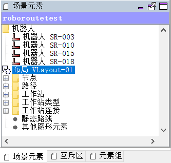

#### 5.4.5 互斥区栏

互斥区的描述请参见本文 4.7 节。如下图，互斥区栏使用树状图表述了互斥区及其所属元素的关系。

#### 5.4.6 元素组栏

元素组的描述请参见本文 4.8 节。如下图，元素组栏同样使用树状图表述其与所属元素的关系。

#### 5.4.7 Kernel 信息

类似于 Kernel 的关键日志页面，显示 Kernel 中的关键信息，例如运行模式切换，场景同步等。

#### 5.4.8 场景视图

场景视图窗口，用于显示场景元素的视图位置及拓扑结构。

请注意，节点和路径的视图位置，不等同于应用现场的真实位置，视图位置只做参考使用；场景的有向拓扑结构，则必须被包含于 .smap 的拓扑结构中。

在 Viewer 编辑模式中，视图窗口用于绘制场景结构；在 Viewer 操作模式中，视图窗口用于监控机器人运行路线及任务动态。

 视图工具栏在场景视图窗口底侧左边：

 其功能如下所述：

| 工具         | 图标                                                 | 描述                         |
| ------------ | ---------------------------------------------------- | ---------------------------- |
| 缩放比例     | 下拉菜单，无图标                                     | 用于选择场景视图的缩放比例   |
| 屏幕自适应   |            | 场景视图自适应屏幕大小       |
| 显示栅格     |                 | 是否显示背景中的栅格线       |
| 显示标尺     |  | 是否显示视图左侧和上方的标尺 |
| 显示标签     |             | 是否显示元素的标签           |
| 显示互斥区   |                | 是否显示互斥区               |
| 显示静态路线 |          | 当前系统版本已弃用静态路线   |

 

#### 5.4.9 业务订单视图

业务订单视图显示近期（最长至15天内）全部业务的有效信息，并可根据业务状态对其进行筛选查询。

其字段含义如下所述：

| 字段           | 释义                                            |
| -------------- | ----------------------------------------------- |
| Name           | 业务订单的全局唯一ID（由业务请求者提供）        |
| 始发工作站     | 需要机器人前往的第一个工作站                    |
| 终点工作站     | 需要机器人前往的最后一个工作站                  |
| 指定机器人     | 指定机器人，或者由 RoboRoute 系统自动分配机器人 |
| 执行中的机器人 | 正在执行业务订单的机器人                        |
| Status         | 业务订单的状态                                  |
| 序列           | 业务订单所属的业务订单序列（暂不使用）          |

其中，业务订单的 Status 字段如下表所述：

| 状态            | 描述                                                         |
| --------------- | ------------------------------------------------------------ |
| RAW             | 原始业务订单。如果长期处于 RAW 状态而无法被激活，说明该订单包含非法元素（不存在于场景中的元素），或者包含其他的错误信息（如 operation 或者 category 错误）。 |
| ACTIVE          | 业务订单已激活。如果长期处于 ACTIVE 状态，可能是由于其所依赖的业务订单尚未执行完成。 |
| UNROUTEABLE     | RoboRoute 无法规划机器人的行进路线。出现此状态时，请检查场景拓扑结构。 |
| DISPATCHABLE    | 业务订单信息无误，路线规划完成，等待系统分配机器人。         |
| BEING_PROCESSED | 业务订单正在被执行。                                         |
| FINISHED        | 业务订单已经执行成功。                                       |
| WITHDRAWN       | 业务订单正在被撤回。                                         |
| FAILED          | 业务订单已经被撤回，并且被标记为失败。                       |

业务订单工具栏在业务订单视图的左上方，如下图所示，

| 工具                                  | 图标                                                | 描述                                   |
| ------------------------------------- | --------------------------------------------------- | -------------------------------------- |
| 筛选状态为 RAW 的业务订单             |           | 筛选不符合业务规则，无法调度的业务订单 |
| 筛选状态为 DISPATCHABLE 的业务订单    |     | 筛选等待分配机器人的业务订单           |
| 筛选状态为 BEING_PROCESSED 的业务订单 |    | 筛选正在执行的业务订单                 |
| 筛选状态为 FINISHED 的业务订单        |      | 筛选已经完成的业务订单                 |
| 筛选状态为 FAILED 的业务订单          |        | 筛选被撤回后的、已标记为失败的业务订单 |
| 撤回业务订单                          |  | 可以批量撤回列表中选取的业务订单       |

撤回业务订单的具体方法，请参见 8.3 节。

双击业务订单列表的任意一条订单，会弹出对话框显示订单的详细信息。

 

其中字段含义如下表：

| 字段       | 释义                                           |
| ---------- | ---------------------------------------------- |
| Name       | 业务订单的全局唯一ID                           |
| 创建       | 业务订单的创建时间                             |
| 完成       | 业务订单的实际完成时间                         |
| 截止时间   | 业务订单的预期截止时间                         |
| 机器人     | 执行该业务订单的机器人                         |
| 非必要订单 | 是否为必须执行至完成的业务订单                 |
| 业务类型   | 订单指定的业务类型                             |
| 拒绝       | 拒绝执行业务的机器人及原因                     |
| 订单子任务 | 每个订单子任务的状态                           |
| 元属性     | 订单或订单子任务的元属性                       |
| 路线       | 订单子任务的路线描述                           |
| 路线成本   | 路线规划时的成本系数                           |
| 订单依赖   | 本业务订单在执行前，必须处于完成状态的业务订单 |

其中，

截止时间是一个可以处在过去、现在或者未来的时间点。RoboRoute 根据订单的截止时间来决定业务的优先级，截止时间越早，优先级越高。

特别的，如果一个订单被设置为非必要订单，那么在机器人执行过程中，如果有新的必要订单请求，RoboRoute 系统可能会终止非必要订单的执行。只有 RoboRoute 系统本身会发出非必要订单，例如前往停靠点等；用户的业务订单请求全部默认为必要订单。

如果一个订单包含了具体的业务类型，则该订单只能被包含此业务类型的机器人所执行。

#### 5.4.10 机器人视图

机器人视图窗口，主要显示场景中机器人的概括信息，如实时位置、电量、在线状态及自身状态等。

机器人的图标以仙知 AMB 无人搬运底盘（Auto Mobile Base，Seer Robotics）为原型，其颜色和意义如下：

| 图标                                         | 释义                 | 图标                                       | 释义                 |
| -------------------------------------------- | -------------------- | ------------------------------------------ | -------------------- |
|    | 空载机器人           |    | 负载机器人           |
|     | 空载机器人，报警状态 |     | 负载机器人，报警状态 |
|  | 空载机器人，充电状态 |  | 负载机器人，充电状态 |

机器人视图中的 “在线状态” ，对应 4.6 节中的机器人在线状态：

| 机器人视图的在线状态 | 机器人在线状态                  |
| -------------------- | ------------------------------- |
| 离线                 | TO_BE_IGNORED，或 TO_BE_NOTICED |
| 在线不可用           | TO_BE_RESPECTED                 |
| 在线可用             | TO_BE_UTILIZED                  |

在本视图中，可以针对单台机器人进行操作，具体方法将在第 8 章中介绍。

#### 5.4.11 业务订单序列视图

RoboRoute 保留功能，暂不启用。

## 六、入门操作一：场景编辑

### 6.1 使用 Roboshop Pro 扫描和绘制地图

本章节内容请参见  Roboshop pro 使用手册。

### 6.2 使用 Roboshop Pro 软件导出 RoboRoute 场景文件

使用 Roboshop 软件对场景环境及路线进行编辑后，点击 “导出”，选择 “导出 RoboRoute 地图”。

 

将出现如下对话框。在 “导出场景” 页面，指定导出的文件路径，点击右下角的 “导出”，可以将 .smap 文件导出为 RoboRoute 的 .xml 场景文件。

如果勾选了左下角的 “加入 block” 复选框，系统会自动检测双向路线（易产生交通死锁）和类双向路线，并将其加入互斥区。

RoboRoute 场景文件包含三个相互独立的部分：场景线路拓扑结构，工作站信息（主要是工作站类型的定义及其操作的描述），机器人信息。通过 Roboshop 导出的场景文件，只包含节点、有向路径等基本的线路拓扑结构。您还需要使用 Viewer 软件，继续添加和完善工作站信息、机器人信息等。

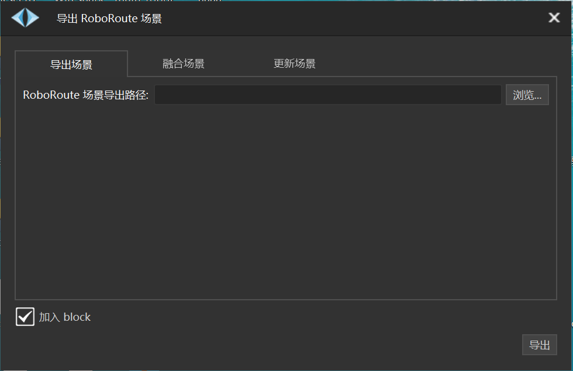

### 6.3 使用 Roboshop Pro 软件融合场景文件

如 6.2 节所述，通过 Roboshop 导出的场景文件，只包含场景的线路拓扑结构。如果在其他场景文件中，存在您需要的工作站信息、或是机器人信息，可以使用 “融合场景” 功能，将不同场景文件中的三类信息组合在一起。

下图的三个路径，第一个是 RoboRoute 场景文件将要导出的路径；

第二个是提取机器人信息的场景文件路径；

第三个是提取工作站信息的场景文件路径。

### 6.4 使用 Roboshop Pro 软件更新场景文件

对于一个场景文件，如果您在 Roboshop 上对相应的 .smap 文件的线路拓扑信息做了稍许改动，而工作站类型、机器人信息完全没有变化，即可以使用 “更新场景” 的功能，将这些改动更新给 RoboRoute 场景文件。

下图的两个路径，第一个是 RoboRoute 场景文件将要导出的路径；

第二个是原场景文件的路径。

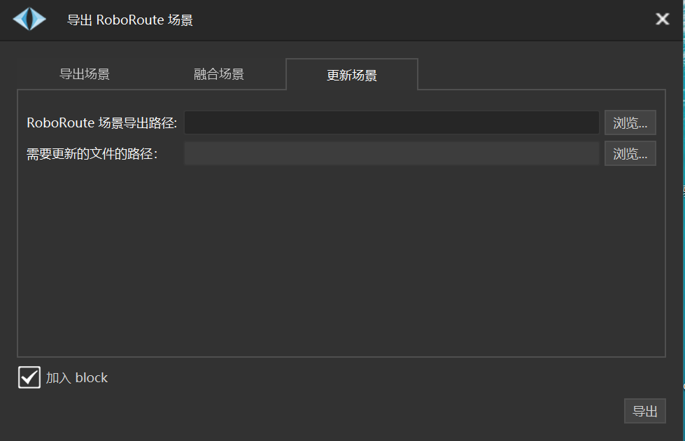

### 6.5 Viewer 模式切换

Viewer 启动时的默认运行模式为编辑模式。若需要切换运行模式，可点击 文件 -> 模式 进行，或者使用组合快捷键。

从编辑模式切换至操作模式时：

如果 Kernel 也处于操作模式，Viewer 将自动导入 Kernel 的当前场景，并进入操作模式。

如果 Kernel 处于编辑模式，Viewer 切换至操作模式将没有意义。

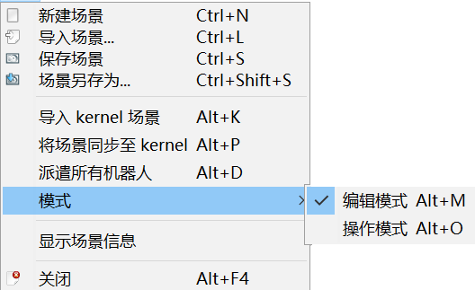

### 6.6 从磁盘中导入场景

在 Viewer 编辑模式下，选择 文件 -> 导入场景，在弹出的 “打开”对话框中，可以从磁盘导入场景文件。

 

### 6.7 添加机器人

在 Viewer 编辑模式下，点击工具栏中的可以添加机器人。此时，机器人只会在场景元素栏中显示，而不会在场景视图中显示。

如 4.6 节所述，机器人 “名称” 要求和铭牌上的完全等同。通过设置 “低电量报警阈值”、“电量充足阈值”，可以影响到机器人的充电逻辑。

若后期的业务订单请求中包含指定的 “业务类型” ，而您又希望该机器人有机会被分配此业务，您可以在编辑场景时，在机器人 “可执行的业务类型” 中添加业务订单中的 “业务类型”。

自主充电类型默认为 ”CHARGE“，您可以修改为其他任意字符串。但请注意，在本机器人适配的充电站中，其工作站类型的 “动作” 里，一定要包含和本机器人 ”自主充电类型“ 完全相同的字符串。

 

### 6.8 添加工作站信息

上文提到，通过 Roboshop 直接导出的 xml 场景文件，不包含具体的工作站信息。默认情况下，首次导出的 xml 场景文件包含三个无任何操作描述的工作站类型，分别是：Charge Location，Transfer Location，和 Working Location。您可以任意添加或删除工作站类型，并且在工作站类型中添加或删除 “动作”（即允许机器人执行的操作，请见 11.4 节）。 

### 6.9 保存场景

在 Viewer 编辑模式下，点击 文件 -> 保存场景（或者使用快捷键 Ctrl + S），可将当前场景保存至磁盘。

若点击 文件 -> 场景另存为（或者使用快捷键 Ctrl + Shift + S），可以将场景保存至磁盘另一路径。

### 6.10 场景元素统计

点击 文件 -> 显示场景信息，将显示如下统计信息：

### 6.11 Viewer 向 Kernel 同步场景

Viewer 编辑模式下的场景，需要同步至 Kernel 才能上线。您可点击 文件 -> 将场景同步至 Kernel（或者使用快捷键 Alt + P）。Viewer 和 Kernel 一般在同一台计算机中运行。在以太网连通的前提下，Viewer 和 Kernel 也可在不同的计算机中运行，但您需要在 Viewer 弹出的对话框中，指定 Kernel 的 IP 地址和端口号（默认为 1099）。

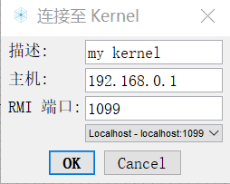

同步成功后，Kernel 日志中会显示 "Kernel created model XXX"（XXX 为场景名称）。

### 6.12 Viewer 导入 Kernel 当前场景

在 Viewer 编辑模式下，点击 文件 -> 导入 Kernel 场景（或者使用快捷键 Alt + K），可将 Kernel 中的场景导入至 Viewer 中。

### 6.13 场景编辑规则

#### 6.13.1 主干路线

场景中的主干路线，要求全部使用单向路线。对于足够宽阔的主干道路，建议设计为包含往、反两个方向的单向路线（如城市中常见的主干道路），如下图所示。

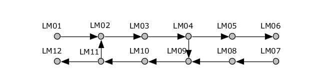

场景中的主干路线，要求能构成有向强联通图。

**注：**若在有向图 G 中，如果对于每一对节点，从 A 节点到 B 节点和从 B 节点到 A 节点都存在路径，则称 G 是强连通图（Strongly Connected Graph）。有向图中的极大强连通子图称做有向图的强连通分量。强连通图具有如下定理：一个有向图 G 是强连通的，当且仅当 G 中有一个回路，它至少包含每个节点一次。 

两点最长距离

 

#### 6.13.2 交叉路线设计

单交叉，双交叉

 

#### 6.13.3 停靠点及工作站设计

 

如上图中的蓝色地标点即为停靠点，建议在场景中设置大于等于机器人数量的停靠点，停靠点放置于主干道之外（如上图），停靠点的进出建议使用单行线。

工作站的设计很大程度上取决于 smap 中的工作点位，由于实际场景中工作点位需要进行产线对接，物料传送等功能，所以在smap转换为XML地图之后，工作站原则上不需要进行手动编辑，只需要定义不同的工作站类型，然后为每个工作站选择工作站类型即可。

#### 6.13.4 双向路线及互斥区

场景设计时我们推荐优先使用单向路线，但是例如充电点位或者特殊工作站，必须使用双向路线的情况，可以启用互斥区进行该区域的保护。

 

在工具栏选择互斥区功能，在信息栏会出现互斥区信息栏，如下图，在场景视图中选择想要添加到该互斥区的元素，然后在该互斥区名称上单击鼠标右键，弹出如下菜单栏，选择添加选中元素至互斥区，被选中元素即可被添加到该互斥区，互斥区颜色可以在信息栏的颜色选择器中进行选择。

 

 

 

互斥区的生成规则：

| 规则                                                         | 示例                                                         | 示例解析                                                     |
| ------------------------------------------------------------ | ------------------------------------------------------------ | ------------------------------------------------------------ |
| 一个点周围均为单向线可以不添加block，但是必须至少一进一出    | 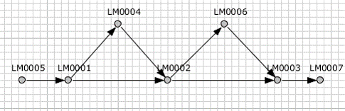                            | 图中车辆汇合点，满足条件1，所以可以不添加block               |
| 双向线两端的点和中间的path自动添加到block                    | 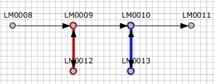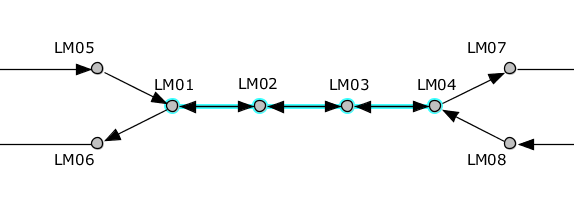 | 图中的所有双向线和两端的point均添加block                     |
| 工作站短暂停靠可以使用双向线，长时间阻挡就必须画成单向线（附：工作站单向线画法） | 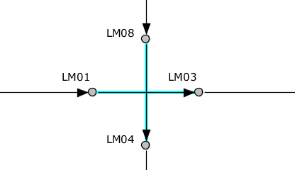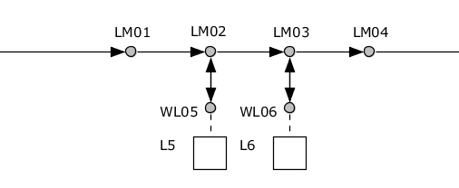 | 左图上为短暂停靠，可以使用双向线；左图下为长时间工作必须使用单向线 |
| 线路交叉必须设置交叉点point                                  | 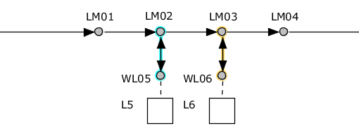                            | 图中十字路口交叉必须做成相交线，包含交叉点point              |

#### 6.13.5有向强连通图

强连通图（Strongly Connected Graph）是指在有向图G中，如果对于每一对节点，从A到B和从B到A都存在路径，则称G是强连通图。有向图中的极大强连通子图称做有向图的强连通分量。强连通图具有如下定理：一个有向图G是强连通的，当且仅当G中有一个回路，它至少包含每个节点一次。 

## 七、入门操作二：机器人配置及操作

### 7.1 使用 Roboshop Pro 软件配置机器人

 

在 Roboshop 中选择参数配置，将 ServerIP 配置成调度服务器的IP地址，ServerPort 配置成调度服务器的端口号（使用默认即可），将 VehicleID 配置成机器人铭牌ID，最后单击永久修改。

### 7.2 使用 Roboshop Pro 软件载入场景对应的 smap

在机器人控制模块加载地图，可以通过 菜单栏->文件->加载地图 唤出文件选择对话框的方式，找到 smap 文件存放的路径，然后打开。

### 7.3 使用 Roboshop Pro 软件重定位机器人

重定位用于使机器人获得正确的定位状态。通过指定一个比较模糊的初始定位点和方向，让机器人自己计算其精确的位置和方向。重定位也是使机器人能进入正确工作状态的重要一步。

如下图所示：

 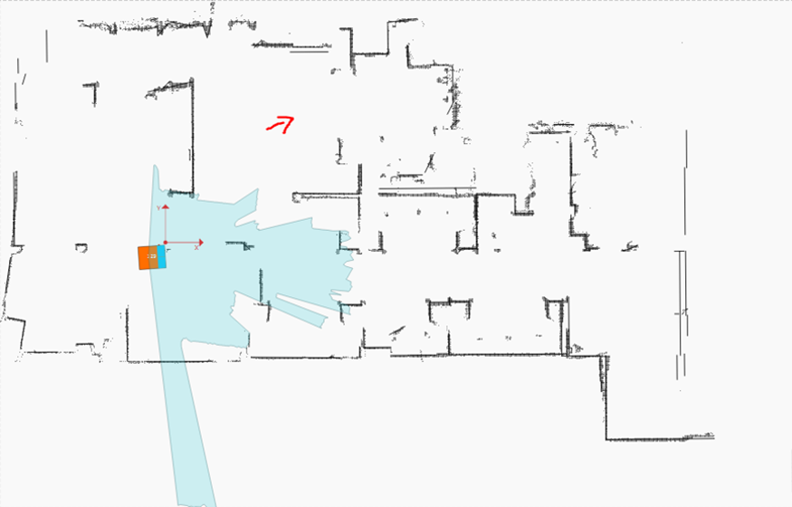

机器人的激光形状没有和地图匹配上，机器人的颜色为橘色说明置信度比较低，因此机器人当前的定位是不正确的。实际情况，机器人处于途中红色箭头标识处。

点击 按钮，鼠标变成蓝色箭头状 。在上图中红色箭头处的位置按下鼠标左键不松开，拖动鼠标拉出方向线，使方向线的朝向与上图中箭头的朝向一致，再松开鼠标左键，如图：

 

此时会弹出正在重定位的对话框：

 

稍等片刻重定位完成后得到如下效果：

 

可以看到机器人的激光已经基本与地图匹配上，此时机器人的定位已经正确。重定位完成后同时会弹出确认位置正确的对话框，点击确定可将机器人定位的状态设置为正确。若点击取消，机器人的定位只是处于定位完成状态，此时仍是无法切换到自动模式的，因为必须将定位状态设置为正确才能切换到自动模式。

如果定位完成后出现如下情况：

 

可以看到，机器人的激光依然没有与地图匹配上，所以这次重定位是失败的，原因可能为点击的重定位点或者拖出的方向线与机器人实际的位置相差太远。此时在弹窗中不能点确定，而应该点取消，然后重新进行重定位操作。

### 7.4 使用 Roboshop Pro 软件释放控制权

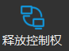

 

在 Roboshop 中将机器人放置到某个确定的点位，然后确认机器人定位正确后，单击释放控制权，使机器人自动去连接调度服务器，如果机器人的状态由UNAVAILABLE变为IDLE，表明连接成功，此时 Roboshop 无法控制机器人动作。

 

### 7.5 使用 Roboshop Pro 软件回收控制权

 

在 Roboshop 中，点击回收控制权可以断开机器人与调度系统的连接，此时可以使用 Roboshop 控制机器人；调度系统中被回收控制权的机器人的状态变为：UNAVAILABLE。

### 7.6 使能机器人通信适配器

 

在适配器栏选择机器人使用的适配器，然后在是否可用栏勾选可用，该适配器即生效。

### 7.7 确认机器人位置 

在 Kernel 中确认机器人位置，该位置与机器人实际位置必须一致。

## 八、入门操作三：Viewer 操作模式

### 8.1 切换至操作模式

在将模型同步至 Kernel 以后，并在 Kernel 中将机器人初始化后，点击 文件 -> 模式，切换到操作模式，或者使用快捷键 Alt + O；此时视图窗口中会出现机器人窗口和场景视图窗口；界面如下：

Viewer 在操作模式下，标题栏会显示 Kernel 的 IP 地址和端口，

### 8.2 新建业务订单

创建业务订单的方式有三种：

1、使用创建业务订单功能：单击添加按钮，选择需要目的地工作站以及所要执行的动作，在机器人复选框中可以指定执行该业务订单的机器人，或者选择自动分配机器人。

 

2、使用 Web API 创建业务订单：Web API 是与调度对接的标准协议，协议提供：创建业务订单，撤回业务订单，查询业务订单状态和机器人状态等功能，详情请看11.5 Web API 链接。

3、使用自动生成业务订单插件创建业务订单：详情请看10.2小节。

### 8.3 业务订单视图

撤销业务订单支持按照订单名称撤回和按照机器人撤回两种方式：

按照订单名称撤回：选中您要撤回的一个或几个订单，然后单击撤回业务订单按钮，将订单撤回。

 

按照机器人撤回：在需要撤回订单的机器人图标上单击鼠标右键，弹出如下菜单栏，选择撤销业务订单，根据实际需求选择撤销订单的方式。

 

 

| 订单撤回方式     | 释义                                               |
| ---------------- | -------------------------------------------------- |
| 并到达下一节点   | 撤销当前执行的订单，但机器人会继续前进到下一个节点 |
| 并立即停止机器人 | 撤销当前执行的订单，机器人立即停止                 |

 

### 8.4 业务订单序列视图

### 8.5 机器人视图

#### 8.5.5 聚焦和跟踪机器人

 

在机器人图标上单击右键，弹出如上图菜单栏，聚焦机器人和跟踪机器人都是为了在复杂的场景中快速定位某台机器人而设定。

聚焦机器人：该机器人的图标颜色会发生如下变化，可以快速区分需要寻找的机器人；

 

跟踪机器人：被跟踪的机器人会被动感光圈所环绕，在机器人行走的过程中，光圈会一直伴随其左右，便于人类发现该机器人；

 

#### 8.5.6 派遣机器人至节点

 

在机器人图标上单击右键，弹出如上图菜单。

派遣至节点提供定点导航功能，选择派遣至节点后选择需要到达的点位，然后单击确定按钮，机器人会自动规划最优路径前往目标节点；

 

 

#### 8.5.7 派遣机器人至工作站

派遣至工作站提供定点导航加执行动作功能，选择派遣制工作站后选择需要到达的工作站并指定到达该工作站后需要进行的动作，然后单击确定按钮，机器人会自动规划最优路径前往目标工作站；

 #### 8.5.8 撤销机器人正在执行的业务订单

#### 8.5.9 更改机器人在线状态

 

在机器人图标上单击右键，弹出如上图菜单。

 

在线状态解析：

| 状态                 | 释义                                                         |
| -------------------- | ------------------------------------------------------------ |
| 将机器人置为离线状态 | 断开机器人与调度服务器的连接，并从当前场景视图中移除，在线状态为离线 |
| 仅标记机器人位置     | 将机器人在场景中的位置占用，在线状态为离线                   |
| 仅将机器人载入场景   | 将移除的机器人重新载入场景并占用当前位置，在线状态为在线不可用 |
| 将机器人置为在线状态 | 将机器人连接到调度服务器，并可以接受业务订单派遣，在线状态为在线可用 |

## 九、典型应用流程

1. 启动服务器，双击桌面上的 StartRoboRoute.bat 文件，启动 RoboRoute。

2. 在 Viewer 中导入场景，并将该场景同步至 Kernel 中。

   

3. 在 Kernel 中，勾选需要启用的机器人，或者 右键 -> 全部可用，启用全部机器人。对于仿真版 RoboRoute，需要为机器人指定初始位置。对于非仿真版的 RoboRoute，如果机器人释放控制权成功，其状态会变为 IDLE，否则状态将变为 UNAVAILABLE。如果机器人已经被导航至线路节点，将在 “位置” 一栏显示出当前所在的节点名；对于没有显示位置的机器人，需要再使用 Roboshop，将机器人导航至最近的节点上，并重新释放控制权。

   

4. 在 Viewer 中将运行模式切换至操作模式，使用一键派遣所有机器人功能，将机器人在线状态全部置为在线可用。此时，机器人将自动前往充电站或停靠点。

   

5. 使用 Viewer 或者用户程序，向 RoboRoute 发送业务订单。机器人将开始执行业务，Viewer 中会标识出其行进路线。

   

6. 当需要关闭 RoboRoute 系统时，请先确认业务请求是否已全部执行完毕，并且不再出现新的业务订单。然后使用 Roboshop 依次回收机器人的控制权。最后双击桌面上的 CloseRoboRoute.bat 文件，结束 RoboRoute 系统进程。

## 十、扩展插件

### 10.1 业务统计

业务统计提供了在系统运行的一段时间内，对机器人、节点、业务订单等元素的初步统计功能。点击 视图 -> 插件 -> 统计，导入 Kernel\log\statistics 目录下的统计文件，可以看到如下图的数据分析列表。

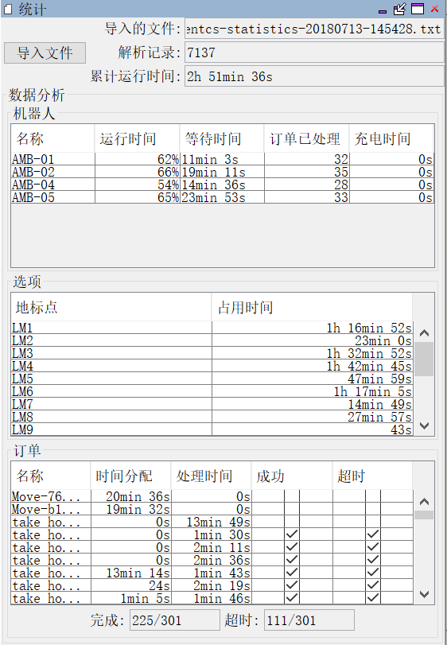

 

### 10.2 随机订单测试

开发者功能，不推荐您使用，此处不做介绍。

## 十一、其他

### 11.1 版权声明

- 本手册会定期进行检查和修正，更新后的内容将出现在新版本中。

- 本手册中的内容或信息如有变更，恕不另行通知。

- 安装、使用产品前请阅读本手册。

- 请保管好本手册，以便随时阅读与参考。

- 本手册所记载的内容，不排除有错误或遗漏的可能性，如对本手册中的内容有疑问，请与我司[联系](mailto:support@seer-robotics.com)。

**Seer Robotics** 和 **仙知** 为上海仙知机器人科技有限公司的注册商标。

上海仙知机器人科技有限公司对本文档内容保留所有权利，请勿重制或分发此文档。

Copyright © 2015 – 2018 Seer Robotics Co.，Ltd.

### 11.2 关键术语中英文对照

| 英文            | 中文           |
| --------------- | -------------- |
| Block           | 互斥区         |
| Category        | 业务类型       |
| Driver Order    | 业务订单子任务 |
| Group           | 元素组         |
| Land Mark       | 地标点         |
| Link            | 工作站连接     |
| Location        | 工作站         |
| Location Type   | 工作站类型     |
| Model           | 场景           |
| Order Sequence  | 订单序列       |
| Park Point      | 停靠点         |
| Path            | 路径           |
| Point           | 节点           |
| Property        | 元属性         |
| Transport Order | 业务订单       |
| Vehicle         | 机器人         |
|                 |                |

### 11.3 常用快捷键

| 操作               | 快捷键          |
| ------------------ | --------------- |
| 新建场景           | Ctrl + N        |
| 导入场景           | Ctrl + L        |
| 保存场景           | Ctrl + S        |
| 场景另存为         | Ctrl + Shift +S |
| 导入Kernel场景     | Alt + K         |
| 将场景同步到Kernel | Alt + P         |
| 派遣所有机器人     | Alt + D         |
| 编辑模式           | Alt + M         |
| 操作模式           | Alt + O         |

### 11.4 目前支持的机器人操作及相关元属性（持续更新）

请注意，所有的键、值都是**字符串类型**数据。

备注中，**required** 指该元属性是操作所必须包含的；

optional 指该元属性是操作可选的；

repeated 指该元属性是操作可选的，且数量 ≥ 1。

| 操作                    | 键            | 值                            | 备注         |
| ----------------------- | ------------- | ----------------------------- | ------------ |
| RollerLoad/RollerUnload | direction     | left / right                  | **required** |
| RollerLoad/RollerUnload | recoginze     | true / false                  | optional     |
| JackLoad/JackUnload     | recognize     | true / false                  | **required** |
| ForkLoad/ForkUnload     | end_height    | 高度数据（单位：米）          | optional     |
| ForkLoad/ForkUnload     | layer         | 0：底层， -1：顶层            | optional     |
| ForkLoad/ForkUnload     | start_height  | 高度数据（单位：米）          | optional     |
| ForkLoad/ForkUnload     | recoginze     | true / false                  | optional     |
| SetDO                   | DO的序号      | true / false                  | repeated     |
| Wait                    | duration      | 非负整数（单位：毫秒）        | optional     |
| Wait                    | inverse_angle | true / false                  | optional     |
| WaitKey                 | DI的序号      | 0 / 1。当DI为该值时，等待结束 | **required** |
| WaitKey                 | timeout       | 非负整数（单位：毫秒）        | optional     |
| ArmReset                |               |                               |              |
| GraspLoad / GraspUnload | from          | 根据具体场景定制              | **required** |
| GraspLoad / GraspUnload | to            | 根据具体场景定制              | **required** |
| GraspLoad / GraspUnload | remark        | 根据具体场景定制              | **required** |
|                         |               |                               |              |

### 11.5 修订历史

| 文件版本 | 发布时间 | 更新描述 | 软件版本      |
| -------- | -------- | -------- | ------------- |
|          |          |          | RoboRoute_1.0 |

### 11.6 业务订单请求 Web API 链接

https://www.seer-robotics.com/plug-in/RoboRoute/index.html

### 11.7 FAQ 链接

TODO

### 11.8 联系我们

网站: www.seer-robotics.com

地址: 上海市浦东新区金桥镇金领之都7号楼203室

邮箱: contact@seer-robotics.com

技术支持:support@seer-robotics.com

商务合作: zhangsui@seer-robotics.com

技术咨询: yys@seer-robotics.com

电话: 400-061-6660 / 086-021-61112205

